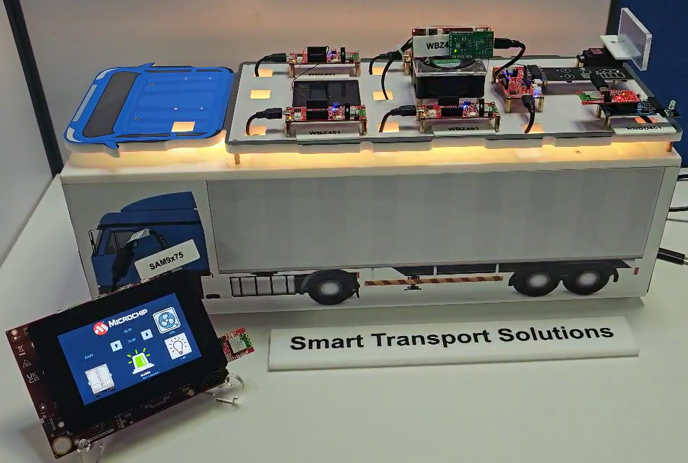

# SMART TRANSPORT SOLUTIONS

> "IoT Made Easy!" 

Devices: **| RNBD451 | WBZ451 | WBZ351 | SAM9X75 |** 
Features: **| BLE |**

## ⚠ Disclaimer

<b>
THE SOFTWARE ARE PROVIDED "AS IS" AND GIVE A PATH FOR SELF-SUPPORT AND SELF-MAINTENANCE. This repository contains example code intended to help accelerate client product development.  

For additional Microchip repos, see: <a href="https://github.com/Microchip-MPLAB-Harmony" target="_blank">https://github.com/Microchip-MPLAB-Harmony</a>

Checkout the <a href="https://microchipsupport.force.com/s/" target="_blank">Technical support portal</a> to access our knowledge base, community forums or submit support ticket requests.

</b>

## Contents

1. [Introduction](#step1)
1. [Bill of materials](#step2)
1. [Software Setup](#step3)
1. [Hardware Setup](#step4)
1. [Harmony MCC Configuration](#step5)
1. [Board Programming](#step6)
1. [Run the demo](#step7)

## 1. Introduction<a name="step1">

The Smart Transport System is a vital demonstration of how modern industries can utilize Bluetooth LE-enabled IoT networks to significantly improve efficiency, automation, and real-time monitoring of critical assets. In practical applications, such systems are essential for optimizing operations in smart transportation, industrial automation, and intelligent infrastructure management. By facilitating seamless communication between sensors, actuators, and control systems, this technology meets the increasing demand for low-latency, reliable data exchange and control.

The Smart Transport System employs a Bluetooth LE-enabled IoT network with a Bluetooth LE star topology, where the Trailer-Central_Network_Unit acts as the central hub, managing communication between multiple sensors, actuators, and the Cabin-DisplayAndControl_Unit. Upon startup, the Trailer-Central_Network_Unit scans and connects to various Bluetooth LE devices, including the Trailer-Temperature_Monitoring, Trailer-Lighting_Control, Trailer-Door_Control, Trailer-Alarm_Control, Cabin-DisplayAndControl_Unit, Trailer-HVAC_FaultDetection, and Trailer-SolarPanel_Sensor. 

Once connected, all sensors transmit their data to the Trailer-Central_Network_Unit, which then relays the information to the Cabin-DisplayAndControl_Unit for real-time monitoring and control. The Trailer-Temperature_Monitoring reports the current temperature to the Trailer-Central_Network_Unit, which also receives the setpoint from the Cabin-DisplayAndControl_Unit and forwards it to the thermostat. Based on this data, the thermostat regulates the HVAC system accordingly. 

The Trailer-Lighting_Control can be managed directly from the Cabin-DisplayAndControl_Unit, while the Trailer-Door_Control can be operated either by physical touch or via the display interface. The Trailer-SolarPanel_Sensor continuously reports voltage levels, which the Trailer-Central_Network_Unit updates on the display. Additionally, the Trailer-HVAC_FaultDetection monitors the HVAC motor, detecting states such as motor on, motor off, or potential faults in the fan. If a fault is detected, the Trailer-Central_Network_Unit triggers the Trailer-Alarm_Control to alert users. By establishing a Bluetooth LE star network, this system ensures efficient, low-latency communication between devices, making it ideal for applications in smart transportation, industrial automation, and intelligent building management. This application showcases the Multi-role Multi-Link feature of the WBZ451 curiosity board.

# Smart Transport System Modules

## Trailer-Central_Network_Unit
This module acts as the central hub of the Bluetooth LE network. It manages communication between all connected sensors, actuators, and the Cabin-DisplayAndControl_Unit. It is responsible for scanning and connecting to various Bluetooth LE devices, collecting data from them, and relaying this information to the display unit for real-time monitoring and control.

## Trailer-Temperature_Monitoring
This module monitors the temperature inside the trailer. It continuously reports the current temperature to the Trailer-Central_Network_Unit. The central unit also receives the desired temperature setpoint from the Cabin-DisplayAndControl_Unit and forwards it to the thermostat, which then regulates the HVAC system to maintain the set temperature.

## Trailer-Lighting_Control
This module controls the lighting within the trailer. It can be managed directly from the Cabin-DisplayAndControl_Unit, allowing users to turn lights on or off and adjust brightness levels as needed.

## Trailer-Door_Control
This module manages the operation of the trailer doors. It can be operated either by physical touch or remotely via the Cabin-DisplayAndControl_Unit. This allows for secure and convenient access control.

## Trailer-Alarm_Control
This module is responsible for triggering alarms in case of any detected faults or emergencies. If the Trailer-Central_Network_Unit detects an issue, such as a fault in the HVAC system, it activates the Trailer-Alarm_Control to alert users.

## Cabin-DisplayAndControl_Unit
This module serves as the user interface for the entire system. It displays real-time data from all connected sensors and allows users to control various aspects of the trailer, such as temperature, lighting, and door operations. It ensures that users have a comprehensive view and control over the trailer's environment.

## Trailer-HVAC_FaultDetection
This module monitors the HVAC system's motor, detecting its operational state (on, off) and identifying potential faults. If a fault is detected, it sends an alert to the Trailer-Central_Network_Unit, which then triggers the Trailer-Alarm_Control to notify users.

## Trailer-SolarPanel_Sensor
This module continuously monitors the voltage levels of the trailer's solar panels. It reports this data to the Trailer-Central_Network_Unit, which updates the information on the Cabin-DisplayAndControl_Unit. This helps in ensuring that the solar panels are functioning correctly and efficiently.

By integrating these modules into a cohesive Bluetooth LE network, the Smart Transport System ensures efficient, low-latency communication and control, making it ideal for applications in smart transportation, industrial automation, and intelligent building management.

