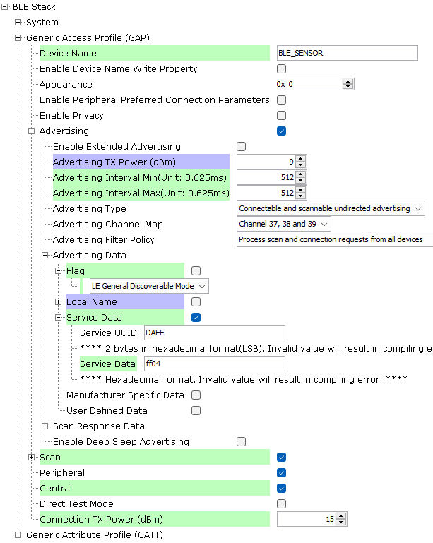
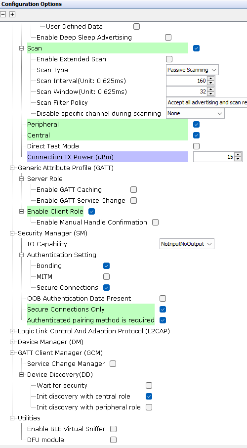
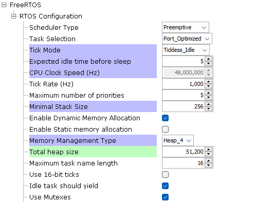

# Trailer-Central_Network_Unit


> "IOT Made Easy!" 

Devices: **| PIC32CXBZ2 | WBZ45x |**<br>
Features: **| BLE |**


## ⚠ Disclaimer

<p><span style="color:red"><b>
THE SOFTWARE ARE PROVIDED "AS IS" AND GIVE A PATH FOR SELF-SUPPORT AND SELF-MAINTENANCE. This repository contains example code intended to help accelerate client product development. </br>

For additional Microchip repos, see: <a href="https://github.com/Microchip-MPLAB-Harmony" target="_blank">https://github.com/Microchip-MPLAB-Harmony</a>

Checkout the <a href="https://microchipsupport.force.com/s/" target="_blank">Technical support portal</a> to access our knowledge base, community forums or submit support ticket requests.
</span></p></b>

## Contents

1. [Introduction](#step1)
1. [Bill of materials](#step2)
1. [Software Setup](#step3)
1. [Harmony MCC Configuration](#step4) 
1. [Board Programming](#step5)

## 1. Introduction<a name="step1">

The Trailer Central Network Unit serves as the central hub in a Bluetooth Low Energy (BLE) Star network, utilizing the WBZ451 Curiosity board. This application demonstrates the Multi-Role Multi-Link capabilities of the board, enabling it to manage communication between various connected sensors, actuators, and the Cabin display and control unit.

1. **Multi-Role Multi-Link**
   - The WBZ451 curiosity board can handle multiple roles and links simultaneously, meaning it can act as both a central and peripheral device, and maintain multiple connections at once.
   - Using this feature the WBZ451 curiosity board can have upto 8 BLE connections.
   - In this application the Trailer Central Network Unit has 7 peripheral connections and 1 central connection(Mobile phone).
   
2. **Scanning and Connecting**
   - The WBZ451 curiosity board continuously scans for available Bluetooth LE devices within its range and establishes connections with them.
   - This ensures that all relevant sensors and actuators are integrated into the network.
   
3. **Peripheral Advertising**
   - The WBZ451 curiosity board also advertises as a peripheral device.
   - Using the Microchip Bluetooth Data (MBD) app, the user can connect to the WBZ451 Curiosity Board to control and monitor the sensor network.
   
4. **Data Collection**
   - Once connected, the WBZ451 curiosity board collects data from the sensors.
   - This data can include environmental parameters, status updates from actuators, and other relevant information.

By leveraging the capabilities of the WBZ451 Curiosity board, the central device ensures efficient and reliable communication within the Bluetooth LE Star network, facilitating seamless integration and control of all connected devices.

## 2. Bill of Materials<a name="step2">

| Tools | Quantity |
| :- | :- |
| [PIC32CX-BZ2 and WBZ451 Curiosity Development Board](https://www.microchip.com/en-us/development-tool/EV96B94A) | 1 |

## 3. Software Setup<a name="step4">

- [MPLAB X IDE ](https://www.microchip.com/en-us/tools-resources/develop/mplab-x-ide#tabs)

    - Version: 6.20
	- XC32 Compiler v4.40
	- MPLAB® Code Configurator v5.5.1
	- PIC32CX-BZ_DFP v1.4.243
	- MCC Harmony
	  - csp version: v3.19.5
	  - core version: v3.13.5
	  - CMSIS-FreeRTOS: v11.1.0
	  - wireless_pic32cxbz_wbz: v1.6.0
	  - wireless_ble: v1.3.0	  
	  - dev_packs: v3.18.1
	  - wolfssl version: v5.4.0
	  - crypto version: v3.8.2
	    
- Any Serial Terminal application like [TERA TERM](https://download.cnet.com/Tera-Term/3000-2094_4-75766675.html) terminal application

- [MPLAB X IPE v6.20](https://microchipdeveloper.com/ipe:installation)

## 4. Harmony MCC Configuration<a name="step5">

### Getting Started with Modbus Server application with the WBZ451 Curiosity Board

| Tip | New users of MPLAB Code Configurator are recommended to go through the [overview](https://onlineDocs.microchip.com/pr/GUID-1F7007B8-9A46-4D03-AEED-650357BA760D-en-US-6/index.html?GUID-AFAB9227-B10C-4FAE-9785-98474664B50A) |
| :- | :- |

**Step 1** - Connect the WBZ451 Curiosity board to the device/system using a micro-USB cable.

**Step 2** - This application is built by using [BLE Sensor Application](https://github.com/Microchip-MPLAB-Harmony/wireless_apps_pic32cxbz2_wbz45/tree/master/apps/ble/advanced_applications/ble_sensor) as the building block. The changes made to the BLE S enosr application is mentioned below.

| Note | The BLE Sensor application repository can be cloned/downloaded from this [link](https://github.com/Microchip-MPLAB-Harmony/wireless_apps_pic32cxbz2_wbz45). |
| :- | :- |
| File path | wireless_apps_pic32cxbz2_wbz45/apps/ble/advanced_applications/ble_sensor/ firmware/ ble_sensor.x |


- In the project graph, select Transaparent profile and configure as follows.


- In the project graph, select BLE Stack and configure as follows.





- In the project graph, select FreeRTOS and configure as follows.



**Step 3** - [Generate](https://onlinedocs.microchip.com/pr/GUID-1F7007B8-9A46-4D03-AEED-650357BA760D-en-US-6/index.html?GUID-2EE03524-41FE-4EBA-8646-6D10AA72F365) the code.

**Step 4** - Once generation is complete, the merge window will appear. Merge all the changes shown.  

**Step 5** -  Copy the mentioned files from this repository by navigating to the location mentioned below and replace the generated files.
 
| Note | This application repository should be cloned/downloaded to perform the following steps. |
| :- | :- |
| Path | The application folder can be found in the following [link](https://github.com/MicrochipTech/PIC32CXBZ2_WBZ45x_BLE_UART_MODBUS) |

- Copy the following files from the cloned repo(...\firmware\src).
	- "app.c" and "app.h",
	- "app_ble_sensor.c" and "app_ble_sensor.h",
	- "app_ble_conn_handler.c" and "app_ble_conn_handler.h"
	- "app_trpc.c" and "app_trpc.h"
	- "app_trps.c" and "app_trps.h"
	- "app_timer" folder
- Replace the above mentioned files in your project folder location(...\firmware\src).
- Copy the following files, which can be found by navigating to the cloned repo path: "...\src\app_ble".
	- "app_trspc_handler.c","app_trspc_handler.h"
	- "app_trsps_handler.c" and "app_trsps_handler.h"
	- "app_ble.c"
- Replace these files in your project folder location(...\firmware\src\app_ble).

- Following the below mentioned steps please add the "app_trpc.c" and "app_trpc.h" to the Source files and header files respectively.

#### To add the folder to your MPLAB project
- In Projects section, right click on Source files to add the ".c" file and right click on Header files to add the ".h" file.
- Select "Add existing items from folder".
- Select Add and browse the location of the folder (...\firmware\src).
- Make sure the "Files of type" is "C Source files" while adding ".c" files and "Header files" while adding ".h" files.
- Select the folder and click "add".

**Step 6** - In "app_user_edits.c", make sure the below code line is commented 

- "#error User action required - manually edit files as described here".

**Step 7** - From projects, go to "app_adv.h" file and add this code in line 104.

```
#define APP_ADV_PROD_TYPE_BLE_SENSOR_MRML                                           0x04          /**< Product Type: BLE Sesnor */
```

**Step 8** - Clean and build the project. To run the project, select "Make and program device" button.

## 6. Board Programming<a name="step6">
 
### Build and program the application using MPLAB X IDE

The application folder can be found by navigating to the following path: 

- ".../firmware/"

Follow the steps provided in the link to [Build and program the application](https://github.com/Microchip-MPLAB-Harmony/wireless_apps_pic32cxbz2_wbz45/tree/master/apps/ble/advanced_applications/ble_sensor#build-and-program-the-application-guid-3d55fb8a-5995-439d-bcd6-deae7e8e78ad-section).

