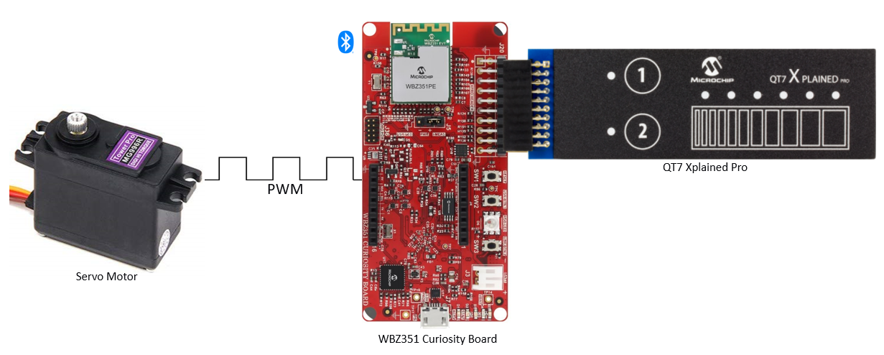
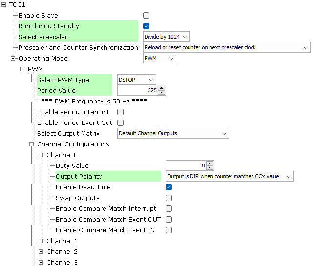
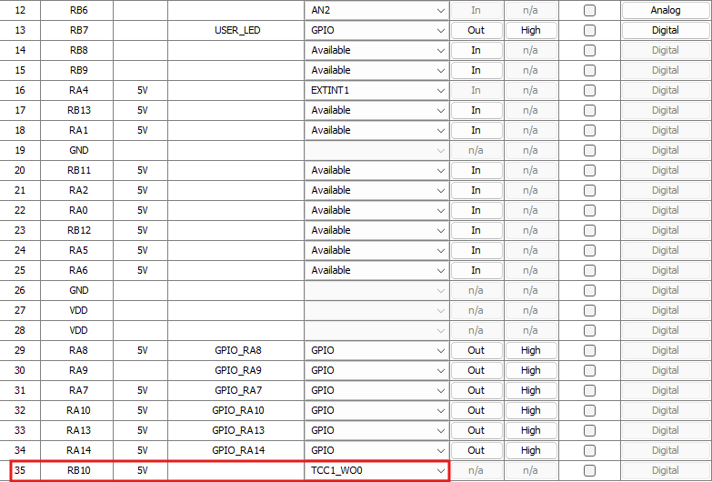

# Trailer-Door_Control


> "IOT Made Easy!" 

Devices: **| PIC32CXBZ3 | WBZ35x | QT7 |**<br>
Features: **| BLE | TOUCH | SERVO |**


## ⚠ Disclaimer

<p><span style="color:red"><b>
THE SOFTWARE ARE PROVIDED "AS IS" AND GIVE A PATH FOR SELF-SUPPORT AND SELF-MAINTENANCE. This repository contains example code intended to help accelerate client product development. </br>

For additional Microchip repos, see: <a href="https://github.com/Microchip-MPLAB-Harmony" target="_blank">https://github.com/Microchip-MPLAB-Harmony</a>

Checkout the <a href="https://microchipsupport.force.com/s/" target="_blank">Technical support portal</a> to access our knowledge base, community forums or submit support ticket requests.
</span></p></b>

## Contents

1. [Introduction](#step1)
1. [Bill of materials](#step2)
1. [Software Setup](#step3)
1. [Hardware Setup](#step4)
1. [Harmony MCC Configuration](#step5) 
1. [Board Programming](#step6)
1. [Run the demo](#step7)
1. [Related Applications](#step8)

## 1. Introduction<a name="step1">

The Trailer-Door Control system utilizes a WBZ351 board in conjunction with a QT7 touch board to manage and monitor trailer doors. It connects to the Trailer-Central_Network_Unit via BLE, reporting door status and allowing users to control the door through touch buttons or a slider to set the door's position. Additionally, these controls can be accessed through a Cabin-DisplayAndControl_Unit.



## 2. Bill of Materials<a name="step2">

| Tools | Quantity |
| :- | :- |
| [WBZ351 Curiosity Board](https://www.microchip.com/en-us/development-tool/ev19j06a) | 1 |
| [QT7 Xplained Pro Extension kit](https://www.microchip.com/en-us/development-tool/atqt7-xpro) | 1 |
| [TowerPro MG996R High Torque Servo Motor](https://amzn.in/d/9SRePsy) | 1 |

## 3. Hardware Setup<a name="step3">

- Connect the QT7 Xpro extension board on the Ext1 header of WBZ351 Curiosity board. The PWM pin from the Mikro Bus header of WBZ351 curiosity board is connected to the PWM pin of the Servo motor.

## 4. Software Setup<a name="step4">

- [MPLAB X IDE ](https://www.microchip.com/en-us/tools-resources/develop/mplab-x-ide#tabs)

    - Version: 6.20
	- XC32 Compiler v4.10
	- MPLAB® Code Configurator v5.1.17
	- PIC32CX-BZ_DFP v1.0.107
	- MCC Harmony
	  - csp version: v3.14.0
	  - core version: v3.11.1
	  - CMSIS-FreeRTOS: v10.4.6
	  - wireless_pic32cxbz_wbz: v1.1.0
	  - wireless_ble: v1.0.0	  
	  - dev_packs: v3.14.0
	  - wolfssl version: v5.4.0
	  - crypto version: v3.7.6
	    
- Any Serial Terminal application like [TERA TERM](https://download.cnet.com/Tera-Term/3000-2094_4-75766675.html) terminal application

- [MPLAB X IPE v6.20](https://microchipdeveloper.com/ipe:installation)

## 5. Harmony MCC Configuration<a name="step5">

### Getting Started with Modbus Server application with the WBZ451 Curiosity Board

| Tip | New users of MPLAB Code Configurator are recommended to go through the [overview](https://onlineDocs.microchip.com/pr/GUID-1F7007B8-9A46-4D03-AEED-650357BA760D-en-US-6/index.html?GUID-AFAB9227-B10C-4FAE-9785-98474664B50A) |
| :- | :- |

**Step 1** - Connect the WBZ451 Curiosity board to the device/system using a micro-USB cable.

**Step 2** - This application is built by using [BLE Sensor Application](https://github.com/Microchip-MPLAB-Harmony/wireless_apps_pic32cxbz2_wbz45/tree/master/apps/ble/advanced_applications/ble_sensor) as the building block. The changes made to the BLE Senosr application is mentioned below.

| Note | The BLE Sensor application repository can be cloned/downloaded from this [link](https://github.com/Microchip-MPLAB-Harmony/wireless_apps_pic32cxbz2_wbz45). |
| :- | :- |
| File path | wireless_apps_pic32cxbz2_wbz45/apps/ble/advanced_applications/ble_sensor/ firmware/ ble_sensor.x |


- From project resources, go to Harmony->Peripherals and select TCC1 and configure as follows.



- In the project graph, go to plugins and select pin configuration.



**Step 3** - [Generate](https://onlinedocs.microchip.com/pr/GUID-1F7007B8-9A46-4D03-AEED-650357BA760D-en-US-6/index.html?GUID-2EE03524-41FE-4EBA-8646-6D10AA72F365) the code.

**Step 4** - Once generation is complete, the merge window will appear. Merge all the changes shown.  

**Step 5** -  Copy the mentioned files from this repository by navigating to the location mentioned below and replace the generated files.
 
| Note | This application repository should be cloned/downloaded to perform the following steps. |
| :- | :- |
| Path | The application folder can be found in the following [link](https://github.com/MicrochipTech/PIC32CXBZ2_WBZ45x_BLE_UART_MODBUS) |

- Copy the following files from the cloned repo(...\firmware\src).
	- "app.c" and "app.h",
	- "app_ble_sensor.c" and "app_ble_sensor.h",
	- "app_ble_conn_handler.c" and "app_ble_conn_handler.h"
	- "app_timer" folder
- Replace these files in your project folder location(...\firmware\src\app_ble).

**Step 6** - In "app_user_edits.c", make sure the below code line is commented 

- "#error User action required - manually edit files as described here".

**Step 7** - From projects, go to "app_adv.h" file and add this code in line 104.

```
#define APP_ADV_PROD_TYPE_ST_DOOR_TOUCH                                             0xA6  //BLE_DOOR_Smart_Truck
```

**Step 8** - Clean and build the project. To run the project, select "Make and program device" button.

## 6. Board Programming<a name="step6">
 
### Build and program the application using MPLAB X IDE

The application folder can be found by navigating to the following path: 

- ".../firmware/"

Follow the steps provided in the link to [Build and program the application](https://github.com/Microchip-MPLAB-Harmony/wireless_apps_pic32cxbz2_wbz45/tree/master/apps/ble/advanced_applications/ble_sensor#build-and-program-the-application-guid-3d55fb8a-5995-439d-bcd6-deae7e8e78ad-section).
