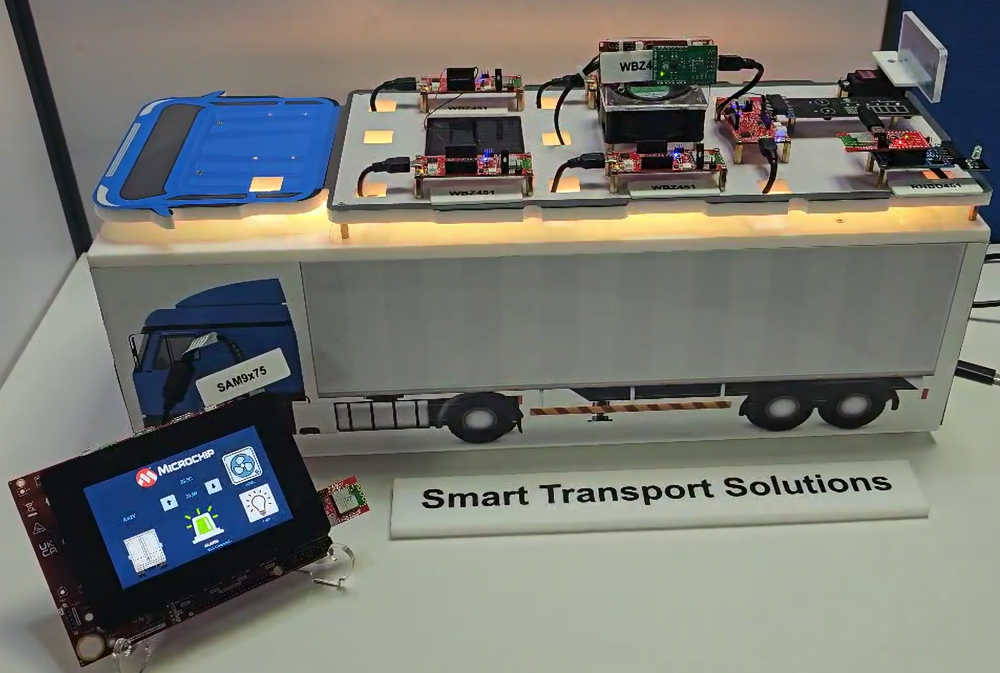

# SMART TRANSPORT SOLUTIONS

> "IoT Made Easy!" 

Devices: **| RNBD451 | WBZ451 | WBZ351 | SAM9X75 |** 
Features: **| BLE |**

## ⚠ Disclaimer

<b>
THE SOFTWARE ARE PROVIDED "AS IS" AND GIVE A PATH FOR SELF-SUPPORT AND SELF-MAINTENANCE. This repository contains example code intended to help accelerate client product development.  

For additional Microchip repos, see: <a href="https://github.com/Microchip-MPLAB-Harmony" target="_blank">https://github.com/Microchip-MPLAB-Harmony</a>

Checkout the <a href="https://microchipsupport.force.com/s/" target="_blank">Technical support portal</a> to access our knowledge base, community forums or submit support ticket requests.

</b>

## Contents

1. [Introduction](#step1)
1. [Bill of materials](#step2)
1. [Software Setup](#step3)
1. [Hardware Setup](#step4)
1. [Harmony MCC Configuration](#step5)
1. [Board Programming](#step6)
1. [Run the demo](#step7)

## 1. Introduction<a name="step1">
In modern industries, smart transport systems play a crucial role in enhancing efficiency, automation, and real-time monitoring of critical assets. The need for seamless communication between sensors, actuators, and control systems is growing, especially in transportation, industrial automation, and intelligent infrastructure management.

The Smart Transport System is a BLE-enabled IoT network that utilizes a BLE star topology, where a Multirole Multilink (MRML) module serves as the central hub, managing communication between multiple sensors, actuators, and a display. On startup, MRML scans and connects to various BLE devices, including a thermostat, light, touch door, alarm, display, AI/ML blade fault predictor, and solar panel. Once connected, all sensors transmit their data to MRML, which then relays the information to the display for real-time monitoring and control. The temperature sensor reports the current temperature to MRML, which also receives the setpoint from the touch display and forwards it to the thermostat. Based on this data, the thermostat regulates the HVAC system accordingly. The lighting system can be controlled directly from the display, while the touch door can be operated either by physical touch or via the display interface. The solar panel continuously reports voltage levels, which MRML updates on the display. Additionally, an AI/ML-powered blade fault predictor monitors the HVAC motor, detecting states such as motor on, motor off, or potential faults in the fan. If a fault is detected, MRML triggers an alarm to alert users. By establishing a BLE star network, this system ensures efficient, low-latency communication between devices, making it ideal for applications in smart transportation, industrial automation, and intelligent building management.This application demonstrates the Multi-role Multi-Link feature of WBZ451 curiosity board. 

