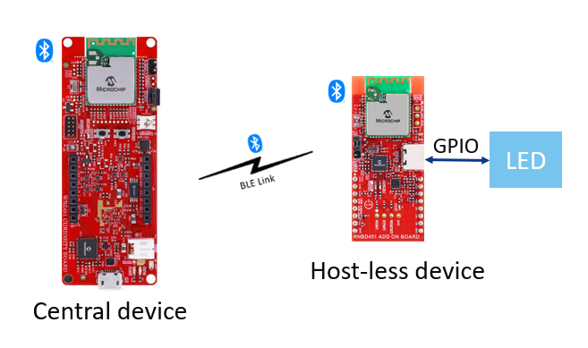
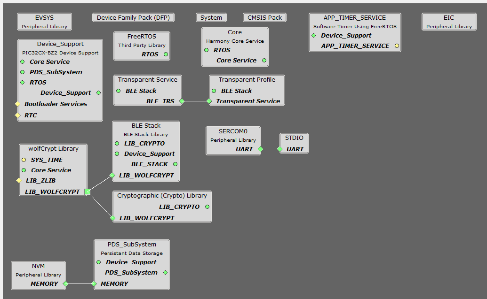
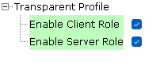
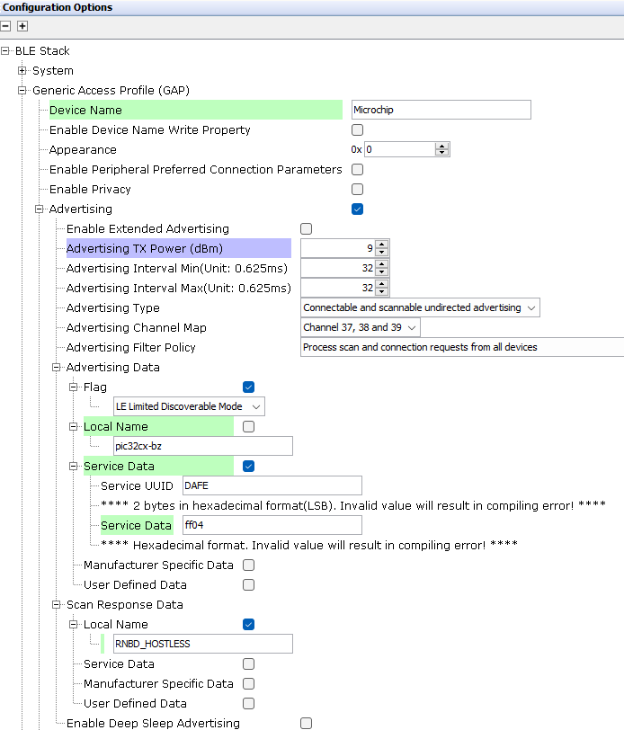
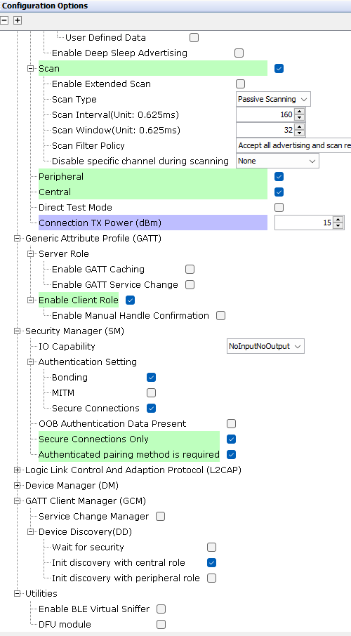
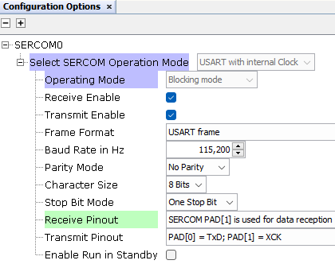
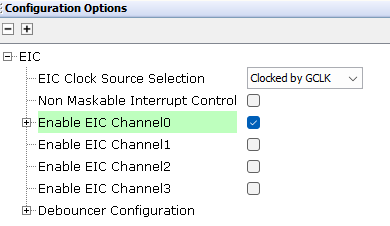
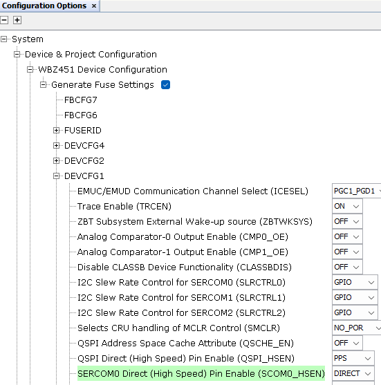
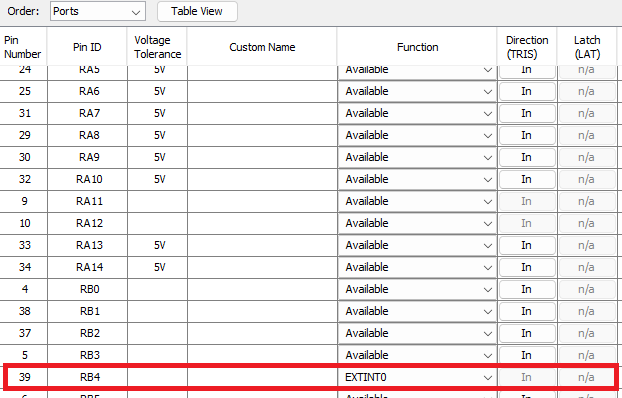
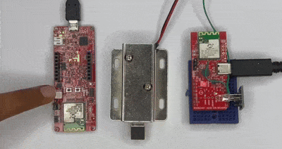

# RNBD451_HOSTLESS_MODE

> "IoT Made Easy!" 

Devices: **| RNBD451 | WBZ451 |** 
Features: **| BLE |**

## ⚠ Disclaimer

<b>
THE SOFTWARE ARE PROVIDED "AS IS" AND GIVE A PATH FOR SELF-SUPPORT AND SELF-MAINTENANCE. This repository contains example code intended to help accelerate client product development.  

For additional Microchip repos, see: <a href="https://github.com/Microchip-MPLAB-Harmony" target="_blank">https://github.com/Microchip-MPLAB-Harmony</a>

Checkout the <a href="https://microchipsupport.force.com/s/" target="_blank">Technical support portal</a> to access our knowledge base, community forums or submit support ticket requests.

</b>

## Contents

1. [Introduction](#step1)
1. [Bill of materials](#step2)
1. [Software Setup](#step3)
1. [Hardware Setup](#step4)
1. [Harmony MCC Configuration](#step5)
1. [Board Programming](#step6)
1. [Run the demo](#step7)

## 1. Introduction<a name="step1">

This application demonstrates the RNBD451 remote command feature. This feature allows the control of an RNBD451 module without the use of a host microcontroller remotely from either another RNBD451 module or a mobile application. 

The remote command feature works by using a special BLE GATT service that emulates a wireless serial connection called transparent UART mode. This combined with a unique command set allows remote functionality of the module. Please check this [link](https://onlinedocs.microchip.com/oxy/GUID-A87FCFF4-A9D1-4EA7-905C-92DA42132554-en-US-2/GUID-84319E16-DCC3-4C50-9B66-83AB732176B2.html) for further details.

This example demonstrates on how to configure RNBD451 in Host-less mode and create a wireless alarm application. This application uses WBZ451 Curiosity board as the central device. On initialization the WBZ451 device will establish a secure and bonded BLE connection with the remote RNBD451 module and will be in Remote Command mode of the RNBD451 Remote/host-less Module. Once there is a button press on WBZ451 board the LED and the solenoid connected to the RNBD451 Host-less device will be switched on/off. 

## 2. Bill of materials<a name="step2">

| TOOLS | QUANTITY |
| :- | :- |
| [RNBD451 Add On Board](https://www.microchip.com/en-us/development-tool/ev25f14a#:~:text=The%20RNBD451%20Add%20On%20Board,%E2%84%A2%20Add%20On%20Bus%20Standard.) | 1 |
| [WBZ451 Curiosity Board](https://www.microchip.com/en-us/development-tool/ev96b94a) | 1 |
| [Solenoid lock](https://amzn.in/d/cmq67zT) | 1 |
| [DC 3V Relay High Level Driver](https://amzn.in/d/4CCwwRJ) | 1 |
| [RGB LED](https://amzn.in/d/cmq67zT) | 1 |

## 3. Software Setup<a name="step3">

- [MPLAB X IDE ](https://www.microchip.com/en-us/tools-resources/develop/mplab-x-ide#tabs)

    - Version: 6.20
	- XC32 Compiler v4.40
	- MPLAB® Code Configurator v5.7.1
	- PIC32CX-BZ_DFP v1.4.243
	- MCC Harmony
	  - csp version: v3.19.5
	  - core version: v3.13.5
	  - CMSIS-FreeRTOS: v11.1.0
	  - CMSIS_5: v5.9.0
	  - wireless_pic32cxbz_wbz: v1.4.0
	  - wireless_ble: v1.3.0
	  - wolfssl version: v5.4.0
	  - crypto version: v3.8.2

- Any Serial Terminal application like [TERA TERM](https://download.cnet.com/Tera-Term/3000-2094_4-75766675.html) terminal application

- [MPLAB X IPE v6.20](https://microchipdeveloper.com/ipe:installation)

## 4. Hardware Setup<a name="step4">

- In the RNBD451 Add on Board, the gpio pins are not brought out. For this application, the GPIO pin PA0 in the Remote module is connected to an NC pin on the Mikro Bus header. Using the relay we have connected the Solenoid by giving the Gpio pin(PA0) as Input to the relay. And in the same manner Gpio pin(PA0) is given to the Green line of the RGB Module.

## 5. Harmony MCC Configuration<a name="step5">

### Getting started with the RNBD Hostless application in WBZ451 Curiosity board 

| Tip | New users of MPLAB Code Configurator are recommended to go through the [overview](https://onlinedocs.microchip.com/pr/GUID-1F7007B8-9A46-4D03-AEED-650357BA760D-en-US-6/index.html?GUID-B5D058F5-1D0B-4720-8649-ACE5C0EEE2C0) |
| :- | :- |

**Step 1** - Connect the WBZ451 Curiosity board setup to the device/system using a micro-USB cable.

**Step 2** - Create a new MCC Harmony project.

**Step 3** - The "MCC - Harmony Project Graph" below depicts the harmony components utilized in this project.

- From Device resources, go to Wireless->Drivers->BLE and select Transparent Service. Accept Dependencies or satisfiers, select "Yes". Select Transparent Profile.

- From the project graph, select BLE Stack. The configuration is depicted as follows.

- From Device resources, go to  Library->Harmony->Peripherals->SERCOM and select SERCOM0. Right click on the "⬦" on UART and select STDIO. The configuration is depicted as follows.

- From Device resources, go to  Library->Harmony->Peripherals->EIC and select EIC. The configuration is depicted as follows.

- From the project graph, select System. The configuration is depicted as follows.

- From Device resources, go to  Library->Harmony->Wireless->System Services and select APP_TIMER_SERVICE.

- From project graph, go to Plugins->PIN configuration and configure as follows.

**Step 4** - [Generate](https://onlinedocs.microchip.com/pr/GUID-A5330D3A-9F51-4A26-B71D-8503A493DF9C-en-US-1/index.html?GUID-9C28F407-4879-4174-9963-2CF34161398E) the code.
 
**Step 5** - Copy the mentioned files from this repository by navigating to the location mentioned below and replace it your project folder. 

| Note | This application repository should be cloned/downloaded to perform the following steps. |
| :- | :- |
| Path | firmware/src |

- Copy the "app_ble" folder, "app_timer" folder, "app.c" and "app.h" which can be found by navigating to the following path: "...\firmware\src"
- Paste the folder under source files in your project folder (...\firmware\src).

The user can achieve the Remote Command mode control functionality by making use of the transparent UART service. To get into the Remote Command mode from a central device, the following steps need to be performed.

- The two devices must be connected using a secured and bonded connection.

- The user has to send the below command via Transparent Control characteristic to make the RNBD451 to enter into the RMT mode. 

- Send an hex “0x59” first and then followed by the PIN code in hex to enter RMT mode. Please refer "APP_MSG_BLE_ENT_RMT_MODE" in "app.c" for implementation.  

- Send an hex “0x46” first and then followed by the PIN code in hex to enter RMT mode. Please refer "APP_MSG_BLE_EXT_RMT" in "app.c" for implementation.  

**Step 6** - Clean and build the project. To run the project, select "Make and program device" button.

## 6. Board Programming<a name="step6">

### Program the precompiled hex file using MPLAB X IPE

- The application hex file can be found in the hex folder.

- Follow the steps provided in the link to [program the precompiled hex file](https://microchipdeveloper.com/ipe:programming-device) using MPLABX IPE to program the pre-compiled hex image. 

### Build and program the application using MPLAB X IDE

Follow the steps provided in the link to [Build and program the application](https://github.com/Microchip-MPLAB-Harmony/wireless_apps_pic32cxbz2_wbz45/tree/master/apps/ble/advanced_applications/ble_sensor#build-and-program-the-application-guid-3d55fb8a-5995-439d-bcd6-deae7e8e78ad-section).

### To configure the RNBD Remote module

- Power the RNBD451 Add-on board via external supply and place the Power select Jumper accordingly.
- Connect RNBD Add-on board to your Mobile phone using a C type cable.
- Follow the below steps to configure the remote module

**Step 1** – Enter command mode

- Input Command: $$$

- Expected response:CMD>

**Step 2** – Set to Factory defaults

- Input Command:SF,2<CR><LF>

- Expected response: Reboot after Factory Reset<CR><LF>

- %REBOOT%

**Step 3** – Enter command mode

- Input Command: $$$

- Expected response: CMD>

**Step 4** – Set advertising data of the module to "DAFEFF10"

- Input Command:NA,Z<CR><LF>

- Expected response : AOK<CR><LF>

- CMD>

- Input Command:NA,16,DAFEFF10<CR><LF>

- Expected response : AOK<CR><LF>

- CMD>

**Step 5** – Enable authentication/security

- Input Command:SA,0<CR><LF>

- Expected response: AOK<CR><LF>

- CMD>

**Step 5** – Save and reboot

- Input Command:R,1<CR><LF>

- Expected response: Rebooting<CR><LF>

- %REBOOT%
	

## 7. Run the demo<a name="step7">

- Once the Remote module is configured, Connect the WBZ451 Curiosity Board.
- On power up the WBZ451 device starts a Secure a and Bonded connection.
- Once connected, by pressing the user button on the WBZ451 Board the user can control the RGB Led/Solenoid connected to RNBD device.

